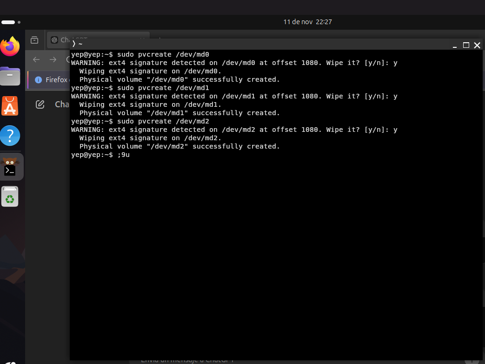
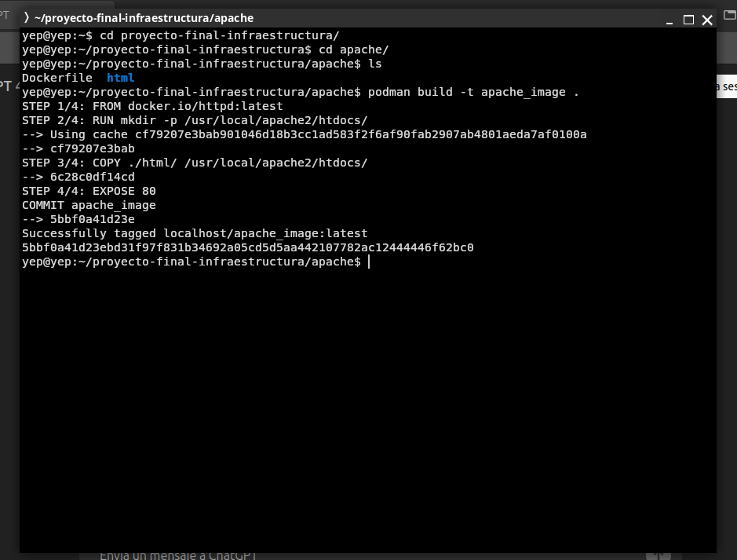
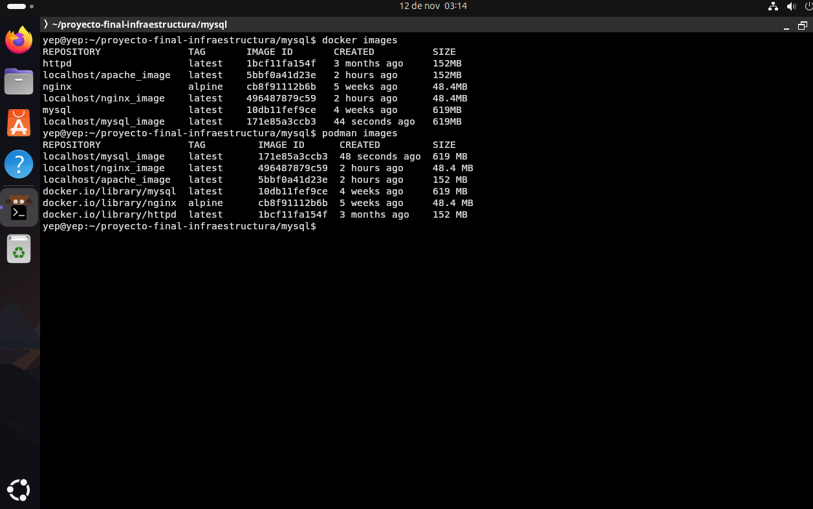

# Proyecto-FInal---infraestructura-Computaci-nal
Bitácora de proyecto final - Infraestructura Computacional

    Proceso para la creación de los RAIDs:

Antes de crear los volúmenes RAID, es necesario disponer de los discos físicos que formarán parte de estos volúmenes. Los discos deben ser de la capacidad adecuada para cumplir con los requerimientos de la infraestructura.

A continuación, se utiliza la terminal para configurar los RAIDs:

a. Creación de los discos necesarios:
 
 

b. Proceso en la terminal para crear los RAIDS:

1. Primero, se verifica que los dispositivos de almacenamiento estén correctamente reconocidos por el sistema utilizando el siguiente comando:

2. Para crear los volúmenes RAID, se utiliza la herramienta mdadm, que permite crear arreglos RAID de diferentes niveles (en este caso, RAID 1). Este proceso implica la selección de los discos y la creación del RAID.

3. Una vez que los RAIDs han sido creados, es necesario verificar que el sistema haya reconocido correctamente los arreglos y que estos estén funcionando. El comando cat lsblk permite visualizar el estado de los RAIDs.

4. Con los RAIDs creados, el siguiente paso es asignarles un sistema de archivos. Esto se hace utilizando el comando mkfs.ext4 para formatear los volúmenes RAID.

   Proceso para la Creación de los Volúmenes Lógicos (LVM)

a. Una vez que los RAIDs han sido configurados, el siguiente paso es crear un volumen físico (PV) que utilizará LVM. Esto convierte el RAID en un volumen gestionado por LVM.

b. Después de crear el volumen físico, se agrupan uno o más volúmenes físicos en un grupo de volúmenes (VG). Este grupo de volúmenes permite la gestión más flexible de los recursos de almacenamiento.

c. Con el grupo de volúmenes (VG) configurado, se procede a crear los volúmenes lógicos (LV). Estos volúmenes son los que finalmente se usarán para montar los sistemas de archivos.

d. Una vez creados los volúmenes lógicos, es necesario formatearlos para que puedan ser utilizados. El formato más común es ext4, pero dependiendo del caso, se pueden utilizar otros tipos de sistemas de archivos.

e. A continuación, se crean los directorios donde se montarán los volúmenes lógicos. 

f. Luego de crear los directorios, se montan los volúmenes lógicos en dichos directorios. Esto asegura que los datos se almacenen en el volumen lógico correspondiente.

g. Para asegurar que los volúmenes lógicos se monten automáticamente al iniciar el sistema, se debe editar el archivo /etc/fstab y agregar una línea para cada volumen lógico:

h. Una vez configurado todo, los volúmenes lógicos se montan correctamente en sus respectivos directorios al iniciar el sistema, sin necesidad de intervención manual.

    Proceso para la creación de las diferentes imagenes que sera usadas: 

a. Para gestionar las imágenes de los contenedores Docker, se crea un directorio donde se almacenarán los archivos Dockerfile.

b. A continuación, se crean los archivos Dockerfile para los contenedores Apache, MySQL y Nginx. Cada Dockerfile define la configuración y los servicios que se ejecutarán en el contenedor.

c. Podman es una alternativa a Docker y se utiliza para construir las imágenes desde los Dockerfiles creados. Cada uno de los servicios (Apache, MySQL, Nginx) se construye utilizando el siguiente comando:
1. Imagen Docker apache: 

2. Imagen Docker mysql: 

3. Imagen nginx:

d. Resultado de la creacion de las imagenes con podman: 

    Proceso de montaje de las imagenes en los volumenes logicos configurados

a. Primero establecemos los volumenes logicos como almacenamiento para los contenedores y a su vez los corremos

b.Verificamos que este en funcionamiento los contenedores: 

c.Mostrar el uso de los diferentes contenedores y su funcionamiento : 
1. Apache: 

2. nginx:

3. mysql: 

